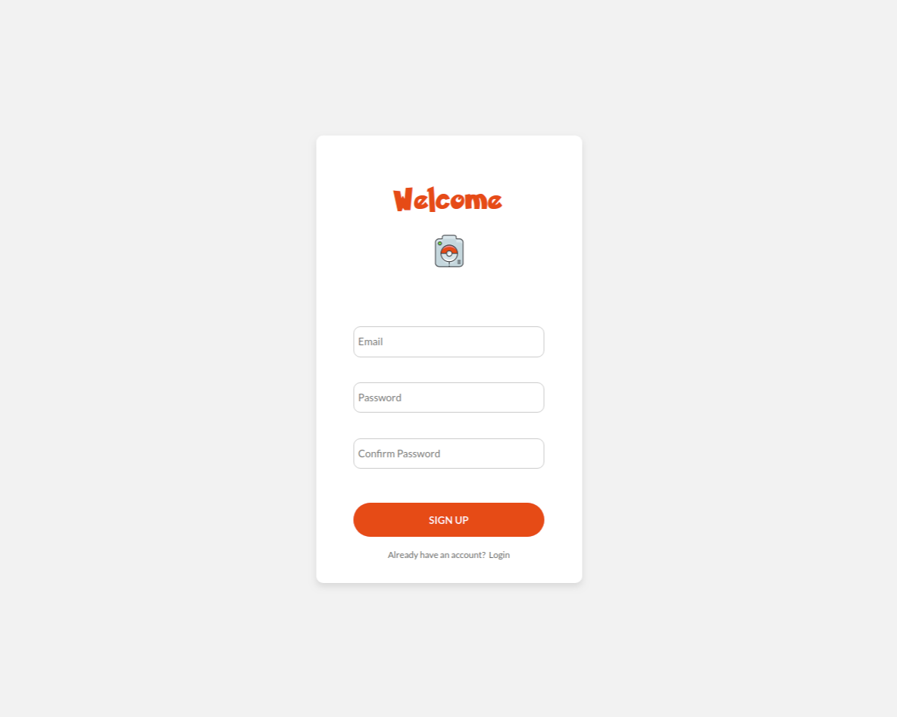
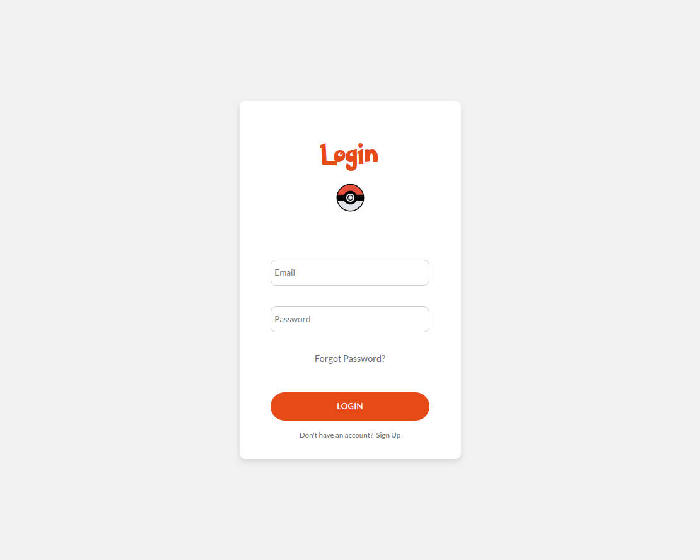
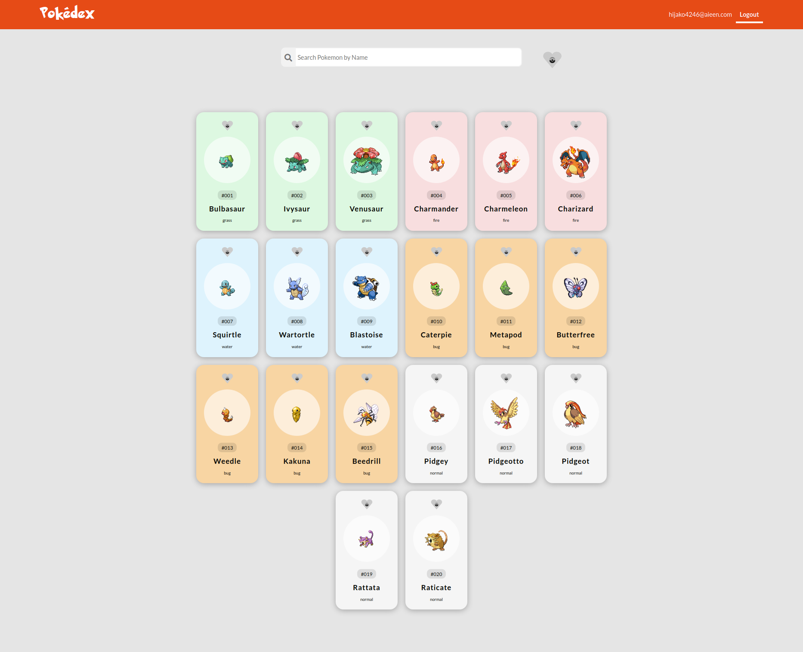

<h1> Pokedex </h1>

## Screenshots:

<p float='left'>



</p>

## Tecnologias:

React | Hooks | API | axios | styled-components | Firebase

[Link para o Trello!](https://trello.com/b/p5F9fkKt/pokedex)

<br/>

## Features

- [x] Sign Up, Login, Verify Email com Firebase
- [x] Search com os Pokemons listados inicialmente
- [ ] Paginação
- [ ] Favoritos

<br/>

## Para rodar localmente:

Faça o download do projeto, ou clone:

```
git clone https://github.com/rlmadruga/pokedex.git
```

<br/>Abra o terminal na pasta e execute o seguinte comando:

```
npm install
```

<br/><strong>Renomeie</strong> o arquivo .env.example para .env e coloque as suas <strong>keys do Firebase</strong>.

<br/>E por fim, execute no terminal:

```
npm start
```

<br/>

## Dificuldades

A cada novo desafio é um aprendizado. Para este, tive que estudar o Firebase para realizar a autenticação dos usuários, foi custosa, mas logo entendi o seu funcionamento. Quanto a API, tive alguns obstáculos com os retornos das Promises, por causa da própria estruturação de dados da mesma.

<br/>

## Agradecimentos

Este teste foi uma grande experiência e oportunidade para o meu crescimento profissional. Afinal, são nesses desafios que percebemos onde devemos melhorar e o quanto evoluimos até a entrega. Obrigada, Happy Code!
